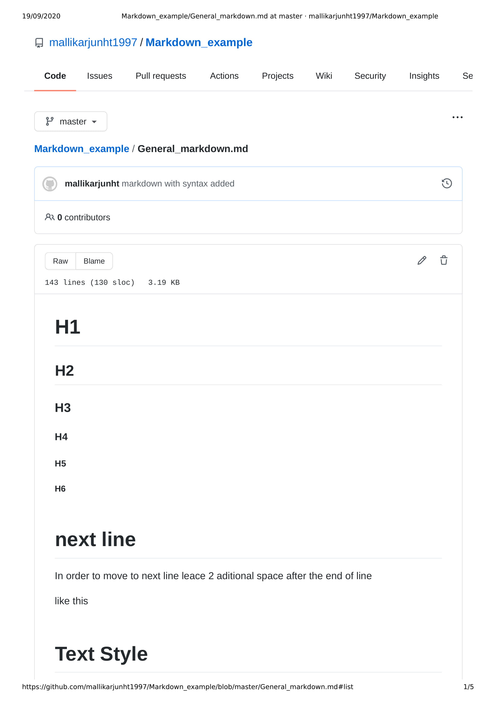
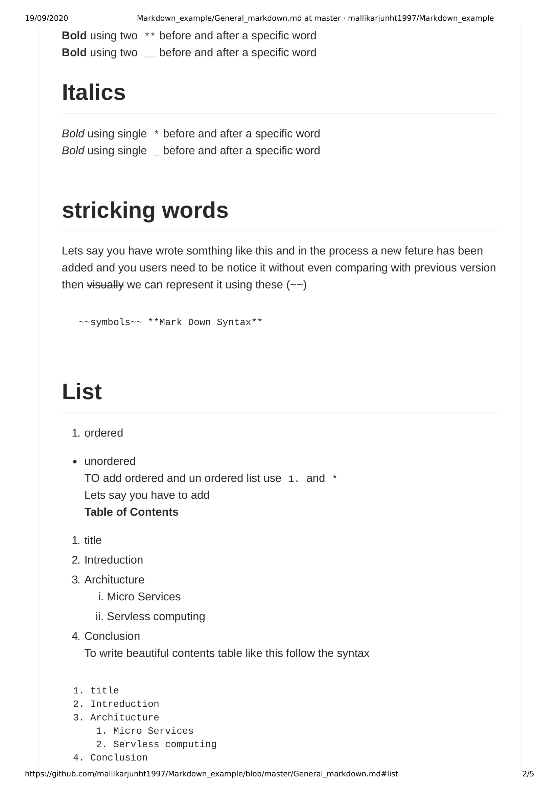
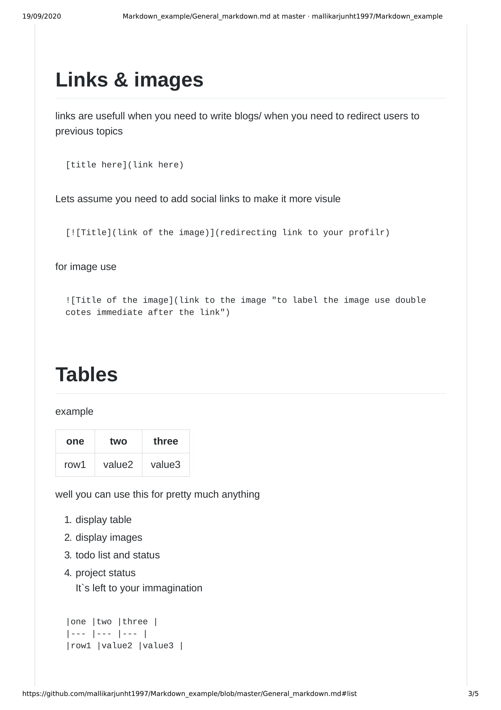
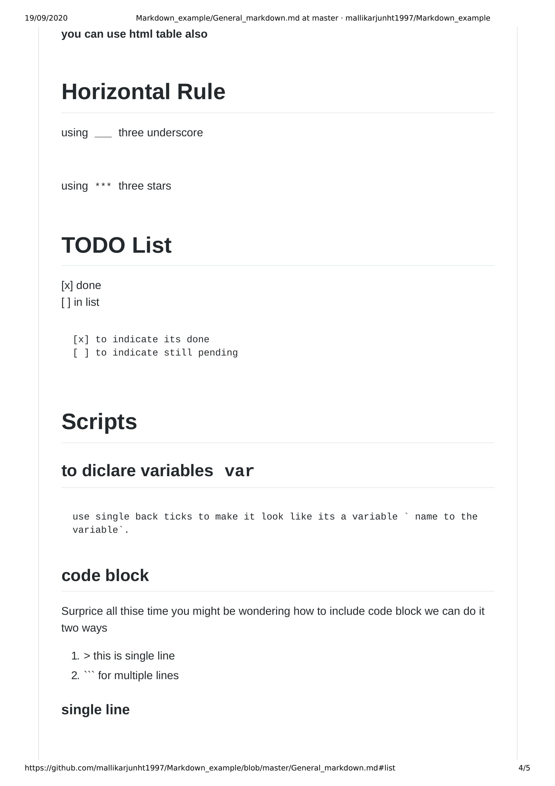
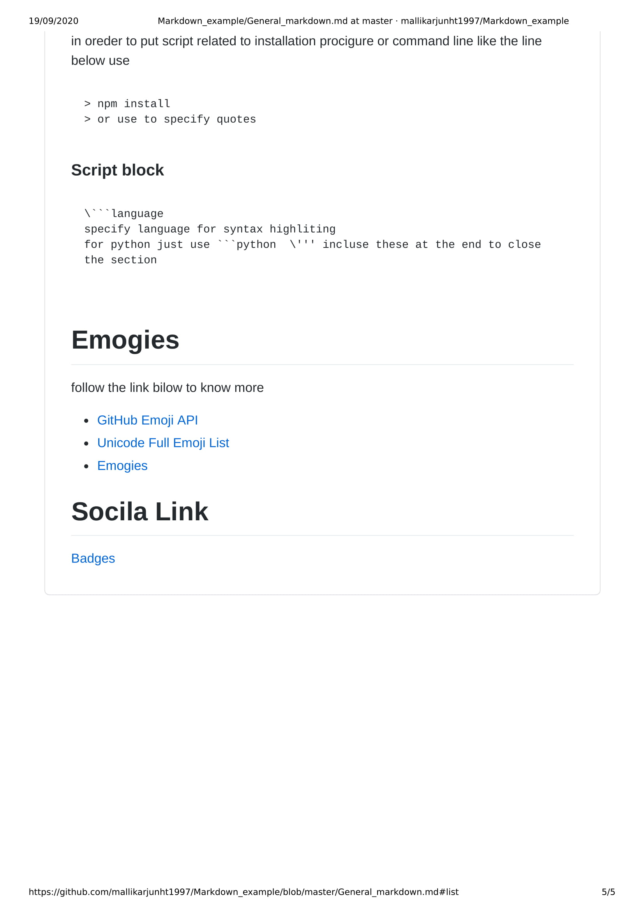

# Markdown_example
how to write markdown?, what i learned in the process  
[Sandbox](https://codesandbox.io/s/epic-leavitt-4cwf6?file=/General_markdown.md)  
[online editor](https://dillinger.io/)  

File [Here](https://github.com/MallikarjunHt/Markdown_example/blob/master/General_markdown.md)
# Table of Content
1. Headings
2. next line
3. Text Style
4. stricking words  
5. Ordere and unordered list  
6. Links & images
7. Tables
8. Horizontal Rule
9. TODO List
10. Scripts
11. Emogies -> 😄  💬
12. Socilal icons and badges

# Images 
 

 

  
